# B3 Data Platform — arquitetura e evolução

Este documento descreve a arquitetura recomendada para a plataforma, considerando o estado atual dos projetos `b3-data-hub` e `market-data-api`. A proposta separa a arquitetura que deve ser operada agora da arquitetura-alvo, evitando introduzir complexidade distribuída antes de existir uma necessidade concreta.

Documentação relacionada:

- [Endpoint `comparisons`](endpoint-comparisons.md): contrato proposto de comparação de dois ou mais tickers, nas variantes GET e POST, incluindo integração com a Nexo.

## 1. Visão executiva

Hoje, a plataforma possui duas responsabilidades principais bem delimitadas:

- `b3-data-hub`: obtém, valida, processa e publica dados históricos da B3.
- `market-data-api`: consulta os dados publicados e os entrega por HTTP.

A recomendação é preservar esses dois serviços e desenvolver analytics, busca e eventos corporativos inicialmente como módulos. Um módulo somente deve se tornar um microsserviço quando precisar de implantação, escala, armazenamento ou ciclo de vida independentes.

## 2. Arquitetura recomendada agora

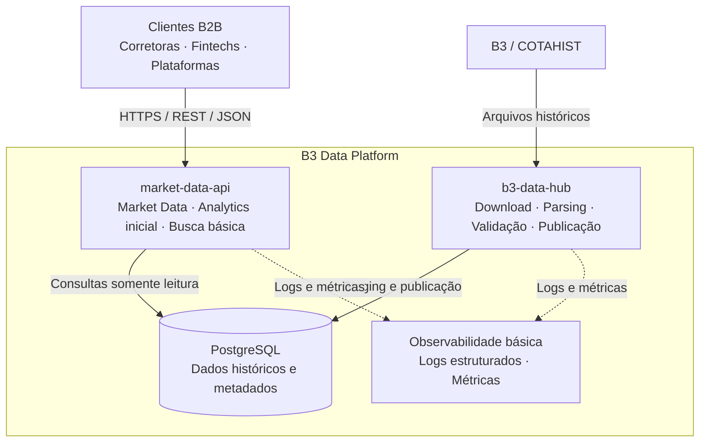

### Responsabilidades atuais

| Componente | Responsabilidade | Evitar |
|---|---|---|
| `b3-data-hub` | Download, parsing, validação, versionamento e publicação | Servir consultas para clientes |
| `market-data-api` | Histórico, última cotação, filtros, paginação e metadados | Download ou parsing do COTAHIST |
| PostgreSQL | Fonte estruturada dos dados publicados | Ser acessado sem limites por todos os futuros serviços |
| Observabilidade | Logs, métricas e diagnóstico | Uma plataforma completa antes de haver demanda |

## 3. Fluxo de ingestão

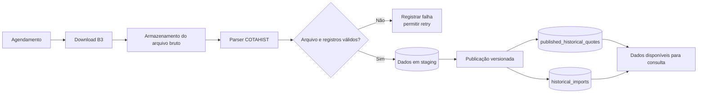

Princípios do fluxo:

- O arquivo bruto deve ser preservado quando for necessário reproduzir uma importação.
- Validação e parsing acontecem antes da publicação.
- Dados incompletos não devem ficar visíveis como uma versão publicada.
- A importação deve registrar origem, horário, versão do parser e versão do layout.
- Retentativas precisam ser idempotentes para não duplicar dados.

## 4. Fluxo de consulta HTTP

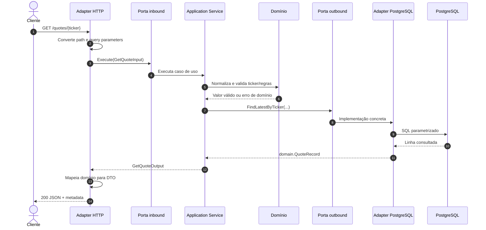

### Fluxos de erro

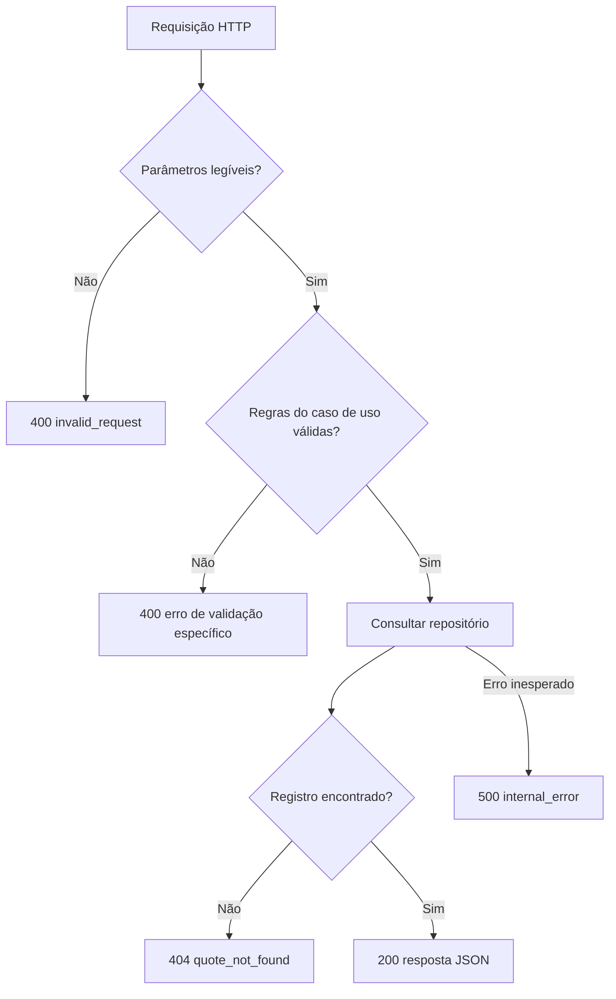

## 5. Arquitetura interna do market-data-api

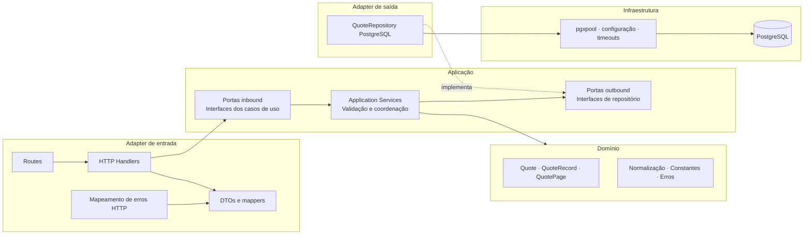

A direção importante das dependências é:

```text
Adapters → Application → Domain
```

O domínio não conhece HTTP, JSON, SQL ou `pgx`. Os serviços conhecem interfaces de repositório, mas não conhecem PostgreSQL.

## 6. Fluxo para implementar um novo caso de uso

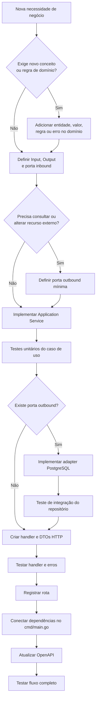

Checklist de cada caso de uso:

1. Identificar regras e tipos de domínio.
2. Definir uma porta de entrada pequena e específica.
3. Definir somente as dependências externas necessárias.
4. Implementar o serviço sem HTTP ou SQL.
5. Testar regras com dependências fake.
6. Implementar o adapter de persistência.
7. Criar handler, DTOs e mapeamento de erros.
8. Registrar rota e montar dependências no `main`.
9. Atualizar o contrato OpenAPI.
10. Executar testes unitários e de integração.

## 7. Organização modular recomendada

Analytics e busca podem nascer dentro do `market-data-api`, mantendo fronteiras internas explícitas:

```text
internal/
├── marketdata/
│   ├── domain/
│   ├── application/
│   └── adapters/
├── analytics/
│   ├── domain/
│   ├── application/
│   └── adapters/
├── search/
│   ├── domain/
│   ├── application/
│   └── adapters/
└── platform/
    ├── database/
    ├── logging/
    └── http/
```

Essa reorganização é uma direção futura, não uma migração obrigatória imediata. A estrutura atual pode crescer até a necessidade dos módulos ficar clara.

## 8. Arquitetura-alvo

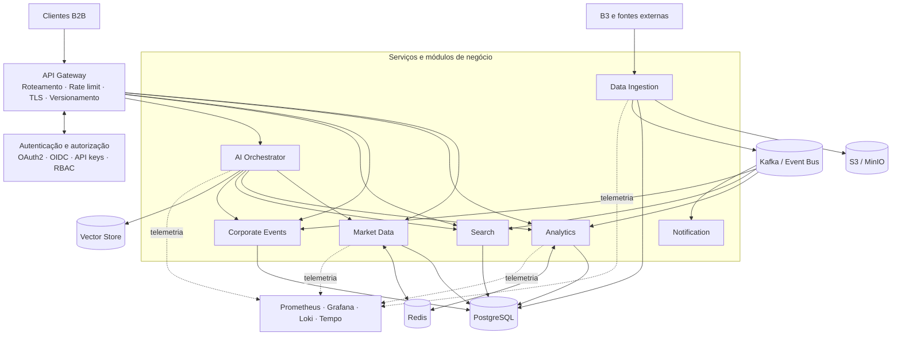

Este desenho é um destino possível, não uma lista de componentes que precisam ser criados imediatamente.

## 9. Critérios para extrair um microsserviço

Um módulo deve ser extraído apenas quando pelo menos uma necessidade concreta justificar o custo:

- Escala de CPU, memória ou tráfego muito diferente do restante da aplicação.
- Implantação ou frequência de mudanças independente.
- Equipe responsável e ciclo de vida próprios.
- Modelo de dados e regras com fronteira clara.
- Requisitos de disponibilidade ou segurança diferentes.
- Processamento assíncrono que não combina com o processo HTTP.

Somente possuir uma responsabilidade diferente não basta. Um monólito modular já permite separar responsabilidades sem introduzir falhas de rede e consistência distribuída.

## 10. Decisões de tecnologia

| Tecnologia | Usar quando | Situação recomendada |
|---|---|---|
| API Gateway | Existirem vários serviços HTTP ou autenticação/rate limit centralizados | Adiar |
| Redis | Métricas demonstrarem consultas repetidas e caras ou houver rate limit distribuído | Adiar e medir primeiro |
| Kafka | Um evento possuir vários consumidores independentes e assíncronos | Adiar; considerar outbox antes |
| Kubernetes | Houver muitos serviços, escala independente e maturidade operacional | Adiar |
| Vector store | Existir busca semântica sobre documentação e conteúdo não estruturado | Adiar |
| RAG | Respostas precisarem usar manuais, comunicados e relatórios | Usar para documentos, não como fonte de cálculos |
| PostgreSQL | Cotações, ativos, indicadores persistidos e busca inicial | Manter |
| Docker Compose/Swarm | Desenvolvimento e operação atual com poucos serviços | Manter por enquanto |

## 11. Dados estruturados e IA

Perguntas quantitativas devem usar ferramentas e APIs determinísticas:

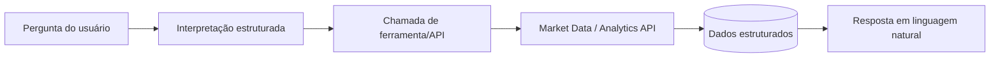

Exemplos: maior preço, volatilidade, médias móveis e comparação de ativos.

RAG deve ser reservado principalmente para documentação não estruturada:

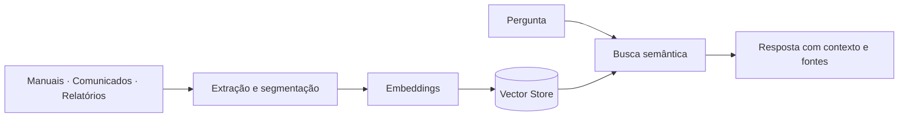

## 12. Evolução do banco compartilhado

No estágio atual, é aceitável que ingestão e API usem o mesmo PostgreSQL se a propriedade for respeitada:

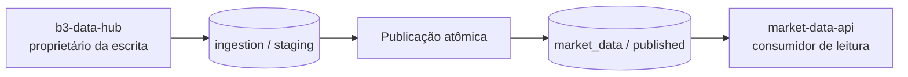

Regras recomendadas:

- A ingestão é proprietária da escrita dos dados históricos.
- A API consulta apenas dados publicados.
- Novos serviços não devem escrever livremente nas mesmas tabelas.
- Separar schemas antes de separar bancos pode ser uma boa etapa intermediária.
- Bancos independentes só são necessários quando a autonomia operacional justificar.

## 13. Roadmap

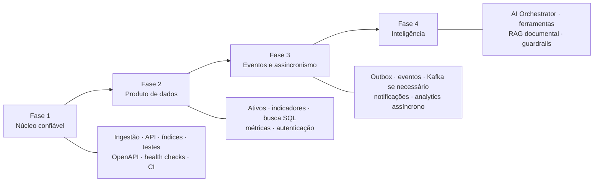

### Fase 1 — núcleo confiável

- Consolidar a ingestão do COTAHIST.
- Consolidar as consultas do `market-data-api`.
- Criar índices e testes de integração.
- Manter o OpenAPI atualizado.
- Adicionar health checks e encerramento gracioso.
- Padronizar migrations, CI e configuração de credenciais.

### Fase 2 — produto de dados

- Adicionar endpoints de ativos e metadados.
- Implementar indicadores como casos de uso internos.
- Usar PostgreSQL para busca inicial por ticker, nome e ISIN.
- Adicionar métricas, autenticação, API keys e rate limiting.
- Introduzir cache somente após medir gargalos.

### Fase 3 — comunicação assíncrona

- Definir eventos estáveis e versionados.
- Implementar transactional outbox na ingestão.
- Introduzir Kafka quando houver múltiplos consumidores reais.
- Processar analytics e notificações de forma assíncrona.

### Fase 4 — inteligência

- Criar um orquestrador de IA que consuma APIs, sem acessar tabelas diretamente.
- Usar ferramentas estruturadas para cálculos financeiros.
- Introduzir RAG para documentação.
- Adicionar auditoria, contexto, memória e guardrails.

## 14. Decisão resumida

```text
Agora:
  b3-data-hub + market-data-api + PostgreSQL + observabilidade básica

Em seguida:
  analytics e busca como módulos + autenticação + métricas

Quando houver demanda comprovada:
  gateway + Redis + eventos/outbox + Kafka + serviços extraídos

Depois:
  AI Orchestrator + RAG documental + infraestrutura distribuída
```

A arquitetura-alvo orienta decisões, mas a arquitetura implantada deve permanecer proporcional ao produto, à carga e à capacidade operacional atuais.
