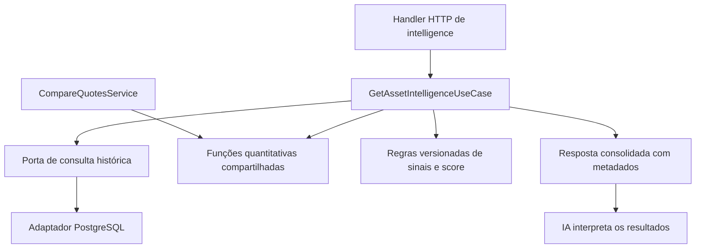

> Contrato atualizado: consulte [intelligence-contrato-atual.md](intelligence-contrato-atual.md).
> Os trechos abaixo registram etapas anteriores. Campos futuros foram removidos
> do JSON; complete/partial considera apenas indicadores implementados.
> O calendário observado já está conectado e a cobertura anual exige includeDetails=true.

# Endpoint `GET /assets/{ticker}/intelligence`

> Calendário: a API agora usa as views consolidadas do `b3-data-hub` com política
> de integridade observada e metadados de origem/cobertura. Ver
> [calendario-intelligence.md](calendario-intelligence.md). A exigência original
> de um calendário exclusivamente oficial foi substituída por essa política.

> Status: desenho original da implementação. A primeira versão HTTP está
> implementada localmente; o contrato vigente está em `../openapi.yaml`.
> Benchmark e demais evoluções deste desenho ainda não estão disponíveis.
> Sem calendário verificado, indicadores retornam indisponíveis. Consulte
> `asset-intelligence-pendencias.md` para o estado atual; deploy ainda pendente.

## Objetivo

Produzir um objeto consolidado de análise quantitativa de um ativo, denominado
**Asset Intelligence**, com preços, retornos, tendência, momentum, risco,
liquidez, comparação com benchmark e evidências para interpretação por IA.

O backend calcula os indicadores e aplica regras determinísticas. GPT, Gemini
ou outro consumidor interpreta os valores recebidos; não calcula RSI,
volatilidade, percentis, sinais ou score a partir de candles. Nenhuma chamada
a modelo de linguagem deve fazer parte deste caso de uso.

## Relação com o que já existe

| Recurso | Responsabilidade |
|---|---|
| `GET /quotes/{ticker}` | Cotação mais recente disponível |
| `GET /quotes/{ticker}/history` | Histórico paginado de cotações |
| `GET /comparisons` e `POST /comparisons` | Comparação entre 2 e 10 ativos em período informado |
| `GET /assets/{ticker}/intelligence` | Análise individual com janelas padronizadas e data de referência |

A repetição de uma métrica nas respostas não deve gerar duplicação de fórmula.
O novo serviço reutilizará funções Go e portas de acesso a dados, sem chamar os
endpoints existentes por HTTP e sem relaxar a validação de `/comparisons` para
aceitar um único ticker.

Hoje, [comparison_calculations.go](../internal/application/services/comparison_calculations.go)
calcula retorno absoluto e percentual, volatilidade anualizada, drawdown máximo,
volume financeiro médio, extremos de preço, melhor/pior dia e correlações.
O [serviço de comparação](../internal/application/services/compare_quotes.go)
também calcula métricas de um benchmark quando seus dados estão disponíveis.
Isso ainda não constitui força relativa ou contexto de mercado.

RSI, médias móveis, percentis históricos, drawdown atual, sinais e score são
capacidades novas. O ranking existente de comparações não equivale a um score.

## Contrato HTTP proposto

```http
GET /assets/PETR4/intelligence?asOf=2026-09-04&marketType=10&benchmark=BOVA11
```

| Parâmetro | Proposta |
|---|---|
| `ticker` | Obrigatório; reutilizar normalização e validação do domínio |
| `asOf` | Opcional, `YYYY-MM-DD`; limita os dados à data informada |
| `marketType` | Opcional, padrão `10`, seguindo a convenção atual |
| `benchmark` | Opcional; ticker com histórico disponível na fonte |

Sem `asOf`, usar a última cotação disponível do ativo. Com `asOf`, usar a última
cotação em ou antes dessa data. Registrar a data solicitada e a efetiva; nunca
usar dados posteriores à referência. Datas futuras devem ser rejeitadas.
Não prometer cotação em tempo real: a fonte atual é B3 COTAHIST.

Não assumir que um índice como IBOV existe na mesma base de ações. O benchmark
do exemplo é apenas ilustrativo e depende de cobertura verificada no banco.

## Objeto de resposta

Manter o envelope `data`/`meta` da API. Os nomes internos em `snake_case` abaixo
seguem a proposta de Asset Intelligence; essa diferença em relação ao
`camelCase` atual precisa ser decidida antes de publicar o contrato.

Exemplo ilustrativo de resposta parcial, com números fictícios:

```json
{
  "data": {
    "ticker": "PETR4",
    "price": {
      "close": "38.20",
      "currency": "BRL"
    },
    "returns": {
      "return_7d": 14.8
    },
    "trend": {
      "sma20": "35.24",
      "distance_sma20": 8.4
    },
    "momentum": {
      "rsi14": 71.3,
      "rsi14_percentile_3y": 91.0
    },
    "risk": {
      "volatility_30d": 32.6,
      "drawdown_current": -2.1,
      "maximum_drawdown_252d": -18.4
    },
    "liquidity": {
      "average_daily_volume_20d": "1850000000.00"
    },
    "relative_strength": null,
    "benchmark": null,
    "market_context": null,
    "signals": [],
    "alerts": [],
    "score": null
  },
  "meta": {
    "status": "partial",
    "requested_as_of": "2026-09-04",
    "as_of": "2026-09-04",
    "source": "B3 COTAHIST",
    "price_adjustment": "unadjusted",
    "window_unit": "trading_sessions",
    "percentage_unit": "percent",
    "calculation_version": "1.0",
    "rules_version": null,
    "unavailable": [
      {"field": "benchmark", "reason": "not_requested"},
      {"field": "relative_strength", "reason": "benchmark_not_requested"},
      {"field": "market_context", "reason": "not_implemented"},
      {"field": "score", "reason": "not_implemented"}
    ]
  }
}
```

Valores percentuais usam `14.8` para representar `14,8%`; RSI e percentil usam
escala de 0 a 100. Preços e volumes financeiros seguem a representação decimal
em string da API atual. Calcular com precisão interna e arredondar na saída.

`null` representa indisponibilidade, nunca zero. `meta.unavailable` deve distinguir
histórico insuficiente, benchmark ausente, dados inválidos e recurso ainda não
implementado. Para sinais e alertas, registrar também indisponibilidade em
metadados quando as regras não tiverem sido executadas; uma lista vazia isolada
não deve sugerir que o ativo foi avaliado e não apresentou ocorrências.

## Convenções de cálculo propostas

Estas são definições de produto a implementar e testar, não uma descrição de
indicadores já disponíveis. O sufixo `d` representará **pregões**, não dias
corridos; documentar isso também no OpenAPI.

| Métrica | Definição proposta |
|---|---|
| `return_7d` | `(C_t / C_(t-7) - 1) × 100`; exige 8 fechamentos |
| `sma20` | Média aritmética dos últimos 20 fechamentos, incluindo a referência |
| `distance_sma20` | `(C_t / SMA20 - 1) × 100` |
| `rsi14` | RSI com suavização de Wilder; inicialização pela média de 14 ganhos/perdas, exigindo 15 fechamentos |
| `rsi14_percentile_3y` | Posição do RSI atual entre os RSI válidos anteriores dos últimos 3 anos civis; excluir o valor atual da distribuição |
| `volatility_30d` | Desvio-padrão amostral de 30 retornos simples consecutivos, multiplicado por `sqrt(252) × 100`; exige 31 fechamentos |
| `drawdown_current` | `(C_t / pico_252 - 1) × 100`, com pico dos fechamentos dos últimos 252 pregões |
| `maximum_drawdown_252d` | Menor drawdown observado contra o pico acumulado dentro da janela de 252 pregões |
| `average_daily_volume_20d` | Média do volume financeiro dos últimos 20 pregões |
| Força relativa por janela | Retorno do ativo menos retorno do benchmark, em pontos percentuais, com datas inicial e final iguais |

Para o percentil, propor `100 × (menores + 0,5 × iguais) / N`; exigir cobertura
de três anos e ao menos 500 observações históricas válidas de RSI. Esse mínimo
é uma política proposta e deve ser versionado. Buscar histórico adicional para
a inicialização do RSI antes do início da distribuição e definir uma regra
estável de inicialização para que o resultado não dependa do tamanho da consulta.

Para RSI, definir explicitamente os casos extremos: apenas ganhos resulta em
100, apenas perdas em 0 e série constante em 50. Não dividir por zero.

O drawdown atual é relativo à janela declarada, não ao máximo de toda a vida do
ativo. Não substituir esse campo pelo drawdown máximo já calculado hoje.

Identificar lacunas usando um calendário de pregões validado. Não preencher
candles ausentes com preços sintéticos e não tratar retornos de vários pregões
como retornos diários. Uma janela incompleta deve indicar indisponibilidade.

## Qualidade e comparabilidade dos dados

A comparação atual informa `priceAdjustment: unadjusted`. A implementação futura
deve preservar a informação equivalente e não apresentar retorno de preço como
retorno total com dividendos. Uma futura série ajustada exige fonte, metodologia
e versão próprias; não misturar bases ajustadas e não ajustadas.

Validar datas únicas, ordenação, preços positivos, moeda, mercado e cobertura.
Usar somente informações disponíveis até `asOf` para indicadores, benchmark e
regras. Se houver correções posteriores na fonte, registrar a versão dos dados
para explicar mudanças em consultas históricas.

Para benchmark, alinhar as datas de comparação. Não comparar retornos com
inícios ou finais diferentes silenciosamente. Ausência de benchmark não deve
impedir a entrega dos indicadores independentes do ativo.

## Sinais, alertas, contexto e score

- `signals`: regras quantitativas versionadas, com identificador, condição,
  janela e evidências numéricas. Exemplo de regra futura: RSI14 acima de 70;
  isso descreve uma condição e não implica automaticamente ordem de venda.
- `alerts`: ocorrências calculadas, como um limiar de risco ou volume atípico.
  Notificações, assinaturas e envio de mensagens não fazem parte deste GET.
- `market_context`: depende de universo de ativos, calendário e fontes
  definidos. Não inferir contexto de todo o mercado usando apenas um ticker.
- `score`: depende de componentes, pesos, normalizações, limites e tratamento
  de dados ausentes documentados. Retornar componentes e versão junto ao total.

Não inventar pesos durante a implementação. Até existir uma especificação
determinística aprovada para cada bloco, reportá-lo como indisponível. A IA não
deve preencher os campos ausentes com estimativas apresentadas como resultados
do backend.

## Arquitetura proposta



1. Extrair funções puras de `comparison_calculations.go` para um pacote
   quantitativo compartilhado, por exemplo `internal/domain/analytics`.
   Preservar fórmulas, unidades, arredondamento e contrato de `/comparisons`.
2. Criar a porta de entrada `GetAssetIntelligenceUseCase`, seu serviço de
   aplicação, handler, DTOs e mapeadores seguindo as camadas existentes.
3. Reutilizar ou estender a porta de histórico para carregar ativo e benchmark
   em lote. O serviço determina a maior janela e o histórico de inicialização;
   não deve fazer uma consulta por indicador ou consumir histórico paginado
   pela interface HTTP pública.
4. Separar validação de séries, cálculo quantitativo, aplicação de regras e
   montagem da resposta. Funções de cálculo não conhecem HTTP, PostgreSQL ou IA.
5. Registrar a rota e atualizar `openapi.yaml` somente quando implementada.

Não é necessária uma tabela nova para a primeira entrega: calcular sob demanda
é a proposta inicial. Se as medições justificarem cache ou materialização,
usar chave com ticker, mercado, referência, benchmark, base de ajuste, versão
dos dados, cálculos e regras. Invalidar após importações ou correções relevantes.

## Erros e observabilidade

| Situação | Comportamento proposto |
|---|---|
| Ticker, mercado ou data inválidos | HTTP 400 no envelope de erro existente |
| Nenhuma cotação do ativo até a referência | HTTP 404 |
| Apenas parte dos indicadores calculável | HTTP 200, `meta.status: partial` e motivos por campo |
| Falha de infraestrutura | Envelope de erro existente, sem convertê-la em histórico insuficiente |

Respeitar cancelamento e timeout do contexto. Registrar duração da consulta,
duração dos cálculos, quantidade de observações, referência e versões.
Não incluir credenciais ou conteúdo completo das séries nos logs.

## Etapas de implementação

1. **Consolidar o contrato:** nomes de campos, calendário, janelas, inicialização
   do RSI, cobertura de benchmark, base de preços e política de dados ausentes.
2. **Extrair o motor existente:** reaproveitar funções e verificar regressão de
   `/comparisons`, sem alterar seu comportamento público.
3. **Entregar análise individual:** preço, retornos, SMA20, distância da média,
   RSI14, volatilidade, drawdowns e volume médio, com metadados completos.
4. **Adicionar histórico longo e benchmark:** percentil de três anos e força
   relativa, com cobertura e alinhamento validados.
5. **Adicionar regras:** sinais, alertas, contexto e score após definição dos
   respectivos contratos e critérios determinísticos.
6. **Medir e otimizar:** avaliar latência, limites de consulta e necessidade de
   cache com dados representativos.

## Validação e critérios de aceite

- Fixtures com resultados esperados calculados independentemente para cada
  fórmula, incluindo séries constantes, crescentes, decrescentes e com perdas.
- Testes nos limites de histórico: 7/8 fechamentos para retorno de 7 pregões,
  14/15 para inicialização do RSI e 30/31 para volatilidade de 30 retornos.
- Testes de datas duplicadas, lacunas, preço inválido, benchmark sem dados e
  consultas históricas sem acesso a observações futuras.
- Testes de paridade das métricas extraídas com o comportamento vigente de
  `/comparisons`, incluindo correlação e tratamento de dados insuficientes.
- Testes HTTP do envelope, unidades, validação, erros e respostas parciais;
  testes PostgreSQL de filtros e limites temporais.
- Testes de percentil com empates, cobertura insuficiente e inicialização
  estável; testes de score e regras apenas quando suas definições existirem.

A entrega estará completa quando o endpoint e seu OpenAPI concordarem, as
métricas forem reproduzíveis para os mesmos dados e versões, as ausências forem
explícitas e nenhum cálculo depender de um modelo de linguagem. Os endpoints
existentes devem continuar compatíveis.
