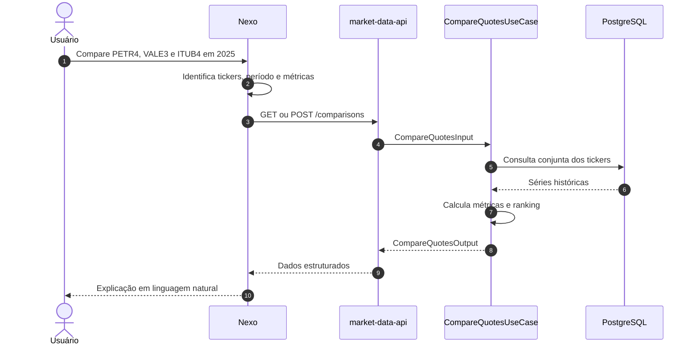
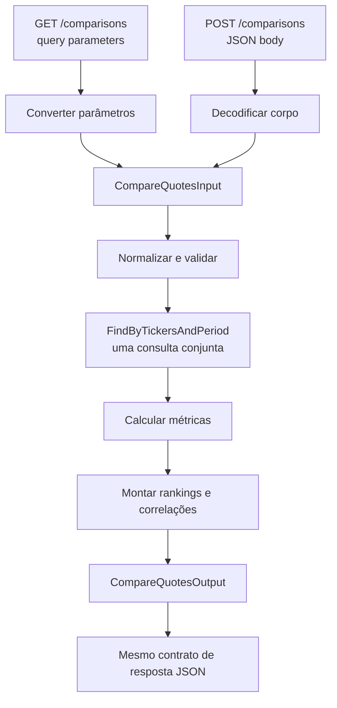

# Endpoint `comparisons`

> Status: implementado na aplicação, PostgreSQL e HTTP. O contrato vigente está
> em `openapi.yaml`; as convenções de cálculo e integração estão em
> `comparison-application.md`. As recomendações abaixo registram o desenho original.

Este documento especifica os endpoints `GET /comparisons` e `POST /comparisons` do `market-data-api`. Ambos executam o mesmo caso de uso de comparação entre dois ou mais ativos. A diferença está apenas na forma de representar a consulta.

## 1. Objetivo

O endpoint compara o desempenho e o risco de dois ou mais tickers em determinado período. Ele entrega dados financeiros estruturados e cálculos determinísticos para clientes B2B e para a Nexo.

Exemplos de perguntas atendidas:

- Qual ativo teve o maior retorno no período?
- Qual apresentou menor volatilidade?
- Qual sofreu o maior drawdown?
- Qual teve maior liquidez?
- Qual ativo superou o benchmark?
- Quais ativos tiveram comportamento mais semelhante?
- Qual apresentou a melhor relação entre risco e retorno?

## 2. Integração com a Nexo



Divisão de responsabilidades:

- O `market-data-api` valida os dados, consulta as séries, executa fórmulas financeiras e monta o ranking.
- A Nexo interpreta a intenção, escolhe os parâmetros, chama a API e explica o resultado.
- A Nexo não acessa diretamente o banco, não gera SQL e não usa o modelo de linguagem para calcular métricas financeiras.

## 3. Quando usar GET ou POST

| Método | Uso indicado | Característica |
|---|---|---|
| `GET /comparisons` | Comparação simples, com poucos parâmetros | Fácil de compartilhar, observar e armazenar em cache |
| `POST /comparisons` | Consulta avançada, com corpo mais rico ou evolução para filtros complexos | Evita URLs extensas e permite uma estrutura mais expressiva |

Os dois métodos:

- São somente leitura.
- Não criam nem alteram comparações no banco.
- Chamam o mesmo `CompareQuotesUseCase`.
- Devem produzir resultados equivalentes quando recebem parâmetros equivalentes.

O uso de `POST` representa uma operação de consulta, e não a criação de um recurso.

## 4. GET `/comparisons`

### Exemplo básico

```http
GET /comparisons?tickers=PETR4,VALE3&from=2025-01-01&to=2025-12-31
```

### Exemplo completo

```http
GET /comparisons?tickers=PETR4,VALE3,ITUB4&from=2025-01-01&to=2025-12-31&marketType=10&metrics=return,volatility,drawdown,averageVolume&benchmark=IBOV&includeSeries=false
```

### Query parameters

| Parâmetro | Tipo | Obrigatório | Padrão | Regra |
|---|---:|---:|---:|---|
| `tickers` | string | Sim | — | Lista separada por vírgulas, contendo de 2 a 10 tickers |
| `from` | date | Sim | — | Data inicial no formato `YYYY-MM-DD` |
| `to` | date | Sim | — | Data final no formato `YYYY-MM-DD` |
| `marketType` | integer | Não | `10` | Deve ser positivo |
| `metrics` | string | Não | Métricas padrão | Lista separada por vírgulas |
| `benchmark` | string | Não | — | Ticker ou identificador de benchmark suportado |
| `includeSeries` | boolean | Não | `false` | Inclui séries temporais na resposta quando `true` |

Exemplo com `curl`:

```bash
curl "http://localhost:8080/comparisons?tickers=PETR4,VALE3&from=2025-01-01&to=2025-12-31"
```

## 5. POST `/comparisons`

### Requisição

```http
POST /comparisons HTTP/1.1
Content-Type: application/json
```

```json
{
  "tickers": ["PETR4", "VALE3", "ITUB4"],
  "from": "2025-01-01",
  "to": "2025-12-31",
  "marketType": 10,
  "metrics": [
    "return",
    "volatility",
    "drawdown",
    "averageVolume"
  ],
  "benchmark": "IBOV",
  "includeSeries": false
}
```

### Campos do corpo

| Campo | Tipo | Obrigatório | Padrão | Regra |
|---|---:|---:|---:|---|
| `tickers` | array de string | Sim | — | Entre 2 e 10 tickers únicos |
| `from` | string/date | Sim | — | Formato `YYYY-MM-DD` |
| `to` | string/date | Sim | — | Formato `YYYY-MM-DD` |
| `marketType` | integer | Não | `10` | Deve ser positivo |
| `metrics` | array de string | Não | Métricas padrão | Somente métricas suportadas |
| `benchmark` | string | Não | — | Benchmark opcional |
| `includeSeries` | boolean | Não | `false` | Controla a inclusão das séries |

Exemplo com `curl`:

```bash
curl -X POST "http://localhost:8080/comparisons" \
  -H "Content-Type: application/json" \
  -d '{
    "tickers": ["PETR4", "VALE3", "ITUB4"],
    "from": "2025-01-01",
    "to": "2025-12-31",
    "metrics": ["return", "volatility", "drawdown"]
  }'
```

## 6. Regras da consulta

- A consulta deve conter no mínimo 2 e no máximo 10 tickers.
- Tickers são normalizados com remoção de espaços e conversão para letras maiúsculas.
- Tickers repetidos são rejeitados ou deduplicados de forma documentada; a recomendação inicial é rejeitar para revelar erros do cliente.
- `from` deve ser anterior ou igual a `to`.
- O intervalo máximo inicial é de cinco anos.
- O `marketType` padrão é `10`, correspondente ao mercado à vista.
- A resposta padrão contém apenas o resumo; séries diárias somente são incluídas com `includeSeries=true`.
- Os tickers devem ser consultados em conjunto, evitando uma consulta SQL por ativo.
- A ordem dos ativos na resposta deve acompanhar a ordem solicitada.

## 7. Métricas suportadas

Primeira versão recomendada:

| Identificador | Descrição |
|---|---|
| `return` | Retorno absoluto e percentual entre o primeiro e o último fechamento disponível |
| `volatility` | Volatilidade dos retornos diários, anualizada quando indicado |
| `drawdown` | Máximo drawdown observado no período |
| `averageVolume` | Volume financeiro diário médio |
| `highLow` | Maior e menor preço do período |
| `bestWorstDay` | Melhor e pior retorno diário |
| `correlation` | Correlação dos retornos entre os ativos |

### Fórmulas e convenções

Retorno percentual:

```text
((fechamento final / fechamento inicial) - 1) × 100
```

Retorno absoluto:

```text
fechamento final - fechamento inicial
```

Retorno diário:

```text
(fechamento atual / fechamento anterior) - 1
```

Volatilidade anualizada para pregões diários:

```text
desvio padrão dos retornos diários × √252
```

Drawdown:

```text
(preço atual / maior preço anterior) - 1
```

As fórmulas efetivamente implementadas devem ser versionadas e documentadas. Arredondamento deve ocorrer apenas na apresentação, nunca nas etapas intermediárias do cálculo.

## 8. Resposta de sucesso

Os dois métodos retornam o mesmo formato:

```json
{
  "data": {
    "assets": [
      {
        "ticker": "PETR4",
        "status": "available",
        "initialPrice": "36.50",
        "finalPrice": "42.10",
        "absoluteReturn": "5.60",
        "percentageReturn": 15.34,
        "annualizedVolatility": 28.41,
        "maximumDrawdown": -12.73,
        "averageDailyVolume": "125400000.00",
        "bestDay": {
          "date": "2025-04-08",
          "return": 7.21
        },
        "worstDay": {
          "date": "2025-05-12",
          "return": -6.14
        }
      },
      {
        "ticker": "VALE3",
        "status": "available",
        "initialPrice": "55.20",
        "finalPrice": "52.80",
        "absoluteReturn": "-2.40",
        "percentageReturn": -4.35,
        "annualizedVolatility": 24.18,
        "maximumDrawdown": -18.62,
        "averageDailyVolume": "98000000.00",
        "bestDay": {
          "date": "2025-03-10",
          "return": 4.82
        },
        "worstDay": {
          "date": "2025-07-18",
          "return": -5.20
        }
      }
    ],
    "ranking": {
      "highestReturn": "PETR4",
      "lowestVolatility": "VALE3",
      "lowestDrawdown": "PETR4"
    },
    "correlations": [
      {
        "tickerA": "PETR4",
        "tickerB": "VALE3",
        "value": 0.42
      }
    ]
  },
  "meta": {
    "requestedTickers": ["PETR4", "VALE3"],
    "from": "2025-01-01",
    "to": "2025-12-31",
    "marketType": 10,
    "metrics": ["return", "volatility", "drawdown", "averageVolume", "correlation"],
    "priceAdjustment": "unadjusted",
    "currency": "BRL",
    "source": "B3 COTAHIST",
    "calculationVersion": "1.0"
  }
}
```

Valores monetários devem ser representados por strings decimais para preservar a convenção já utilizada pela API. Percentuais e coeficientes podem ser números.

## 9. Resposta parcial e dados insuficientes

A ausência de dados para um ticker não deve necessariamente invalidar toda a comparação. Quando pelo menos dois ativos possuírem dados suficientes, a API pode retornar `200 OK` com o status individual:

```json
{
  "ticker": "ABCD3",
  "status": "insufficient_data",
  "availableFrom": null,
  "availableTo": null,
  "message": "No quotes were found for the requested period"
}
```

Regras sugeridas:

- Dois ou mais ativos válidos: retornar a comparação e indicar ativos sem dados.
- Menos de dois ativos com dados suficientes: retornar `422 Unprocessable Entity`.
- Benchmark sem dados: manter a comparação dos ativos e indicar que o benchmark não foi calculado.
- Rankings devem ignorar ativos com dados insuficientes.

## 10. Séries temporais opcionais

Com `includeSeries=false`, a API retorna apenas as métricas agregadas. Essa deve ser a opção padrão para reduzir latência, tráfego e consumo de contexto pela Nexo.

Com `includeSeries=true`, cada ativo pode incluir:

```json
{
  "series": [
    {
      "date": "2025-01-02",
      "closePrice": "36.50",
      "normalizedPerformance": 100.0
    },
    {
      "date": "2025-01-03",
      "closePrice": "37.05",
      "normalizedPerformance": 101.51
    }
  ]
}
```

Uma evolução possível é oferecer granularidade diária, semanal ou mensal. Isso não precisa fazer parte da primeira versão.

## 11. Preços ajustados

A primeira versão deve declarar explicitamente:

```json
"priceAdjustment": "unadjusted"
```

Sem ajustes por dividendos, desdobramentos e agrupamentos, a comparação representa variação de preço, não retorno total para o acionista. A Nexo deve considerar essa informação ao explicar o resultado.

Evolução prevista:

```text
adjustment=none
adjustment=splits
adjustment=total_return
```

Essa evolução depende de uma fonte confiável de eventos corporativos e de regras de ajuste documentadas.

## 12. Erros

### Tickers em quantidade inválida — `400`

```json
{
  "error": {
    "code": "invalid_tickers",
    "message": "tickers must contain between 2 and 10 unique values",
    "field": "tickers",
    "retryable": false
  }
}
```

### Intervalo inválido — `400`

```json
{
  "error": {
    "code": "invalid_date_range",
    "message": "date range cannot exceed five years",
    "field": "dateRange",
    "expectedFormat": "YYYY-MM-DD",
    "retryable": false
  }
}
```

### Métrica desconhecida — `400`

```json
{
  "error": {
    "code": "invalid_metric",
    "message": "unsupported comparison metric",
    "field": "metrics",
    "value": "sharpeRatio",
    "retryable": false
  }
}
```

### Dados insuficientes — `422`

```json
{
  "error": {
    "code": "insufficient_comparison_data",
    "message": "at least two assets must have sufficient data",
    "retryable": false
  }
}
```

### Erro inesperado — `500`

```json
{
  "error": {
    "code": "internal_error",
    "message": "an unexpected error occurred",
    "retryable": true
  }
}
```

## 13. Arquitetura interna proposta

```text
internal/application/ports/inbound/compare_quotes.go
internal/application/services/compare_quotes.go
internal/adapters/inbound/http/handlers/comparisons.go
internal/adapters/inbound/http/response/comparison.go
```

Contrato conceitual da porta de entrada:

```go
type CompareQuotesInput struct {
    Tickers       []string
    From          time.Time
    To            time.Time
    MarketType    int
    Metrics       []ComparisonMetric
    Benchmark     string
    IncludeSeries bool
}

type CompareQuotesOutput struct {
    Assets       []AssetComparison
    Ranking      ComparisonRanking
    Correlations []AssetCorrelation
}

type CompareQuotesUseCase interface {
    Execute(
        ctx context.Context,
        input CompareQuotesInput,
    ) (CompareQuotesOutput, error)
}
```

Porta de saída específica:

```go
type ComparisonQuoteRepository interface {
    FindByTickersAndPeriod(
        ctx context.Context,
        tickers []string,
        from time.Time,
        to time.Time,
        marketType int,
    ) (map[string][]domain.QuoteRecord, error)
}
```

A interface específica evita aumentar desnecessariamente o contrato geral de `QuoteRepository` e facilita a criação de fakes nos testes.

## 14. Fluxo interno dos dois métodos



## 15. Desempenho e cache

- Evitar o padrão N+1: todos os tickers devem ser consultados em uma operação de repositório.
- Criar índices compatíveis com `ticker`, `market_type` e `trading_date`.
- Manter `includeSeries=false` como padrão.
- Aplicar timeout e limite de cinco anos.
- Medir latência antes de adicionar Redis.
- Se houver cache, a chave deve incluir tickers normalizados, período, mercado, métricas, benchmark, ajuste e versão de cálculo.
- Respostas GET podem receber cache HTTP (`ETag` ou `Cache-Control`) quando a política de publicação estiver definida.
- POST pode usar cache interno com uma chave derivada do corpo normalizado, caso medições justifiquem.

## 16. Segurança e governança

- Aplicar os mesmos mecanismos de autenticação e autorização dos demais endpoints.
- Limitar tamanho do corpo e quantidade de tickers.
- Não aceitar fragmentos de SQL, nomes de colunas ou fórmulas arbitrárias.
- Usar uma enumeração fechada para métricas.
- Registrar duração, quantidade de ativos e métricas solicitadas, sem registrar credenciais.
- Versionar o contrato OpenAPI e a versão dos cálculos.

## 17. Estratégia de implementação

1. Definir tipos, métricas e erros de domínio.
2. Criar `CompareQuotesInput`, `CompareQuotesOutput` e `CompareQuotesUseCase`.
3. Criar uma porta de repositório específica para consultas em lote.
4. Implementar e testar as regras e cálculos no application service.
5. Implementar a consulta PostgreSQL conjunta.
6. Criar um mapper comum usado pelos handlers GET e POST.
7. Implementar os dois handlers chamando o mesmo caso de uso.
8. Registrar as duas rotas.
9. Atualizar `openapi.yaml` com contratos e exemplos.
10. Adicionar testes unitários, de handler e de integração.

## 18. Escopo recomendado para a primeira versão

Incluir:

- GET e POST.
- Entre 2 e 10 tickers.
- Período máximo de cinco anos.
- Mercado à vista como padrão.
- Retorno absoluto e percentual.
- Máxima e mínima.
- Volatilidade anualizada.
- Máximo drawdown.
- Volume financeiro médio.
- Melhor e pior dia.
- Resposta parcial para ticker sem dados.
- Indicação explícita de preços não ajustados.

Adiar:

- Preços ajustados e retorno total.
- Séries semanais e mensais.
- Métricas definidas dinamicamente pelo cliente.
- Redis antes de existirem métricas de desempenho.
- Extração para um `analytics-service` independente.

O endpoint deve nascer como um caso de uso de analytics dentro do `market-data-api`. Sua extração para outro serviço só deve ocorrer se os cálculos exigirem escala, processamento ou implantação independentes.
